#  Lighthouse-Badger :badger:

<table>
<tr>
<td align="center" colspan="2">

</td>
</tr>

<tr>
<td align="right" width="400px">
 
 
</td>

<td align="left" width="400px">
 
 
</td>
</tr>

<tr>
<td align="center" colspan="2">

</td>
</tr>
</table>

#  Branch-Pruner :scissors:

<table>
<tr>
<td align="center" colspan="2">

</td>
</tr>

<tr>
<td align="right" width="400px">
 
 
</td>

<td align="left" width="400px">
 
 
</td>
</tr>

<tr>
<td align="center" colspan="2">

</td>
</tr>
</table>

# See you :wave:

### Note on protected brand names and logos
> * The use of protected brand names, trade names, utility models and brand logos on this website does not constitute an infringement of copyright; rather, it serves as an illustrative note. Even if this is not marked as such at the respective points, the corresponding legal provisions always apply.
> * The brand names and logos used are the property of their respective owners and are subject to their copyright provisions.
> * This offer is in no way related to the legal entities of the protected brand names and logos used.

### Note on liability for links
> * This README contains links to external third-party websites. The README operator has no influence on the content of these sites. Therefore, he cannot assume any liability. Instead, the respective provider is always responsible for the content.
> * The linked pages were checked for possible legal violations at the time of linking and illegal content wasn't discernible. A permanent control of the linked pages is unreasonable without concrete evidence of an infringement. However, if the README operator becomes aware of such a violation, he will act immediately. 

### Readme uses
> * [star-solid.svg](https://fontawesome.com/v5.15/icons/star?style=solid "Check it out") & [code-branch-solid.svg](https://fontawesome.com/v5.15/icons/code-branch?style=solid "Check it out") [License: [CC&nbsp;BY&nbsp;4.0](https://fontawesome.com/license/free "Check it out"); Copyright: ©️  Fonticons, Inc.; Changes: made]
> * [GitHub Readme Stats](https://github.com/anuraghazra/github-readme-stats "Check it out") [License: [MIT](https://github.com/anuraghazra/github-readme-stats/blob/master/LICENSE "Go there"); Copyright ©️ 2021 Anurag Hazra]
> * [Shields.io](https://github.com/badges/shields "Check it out") [License: [CC0&nbsp;1.0](https://github.com/badges/shields/blob/master/LICENSE "Go there")] 
